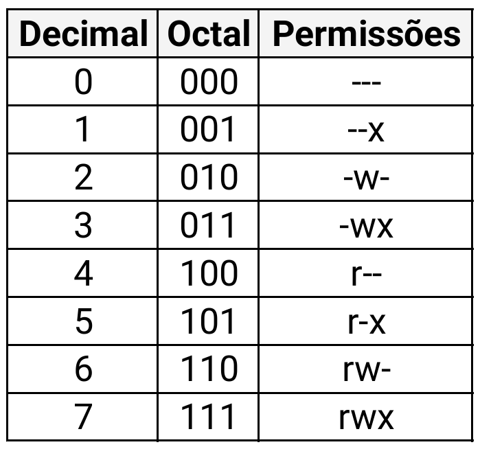

# Permissões e Donos (Ownership)

### Visualizar permissões

1. `ls -l`
   - como já vimos, este comando exibe as permissões na primeira coluna.

```bash

ls -l arquivo.txt
# saída exemplo: -rw-r--r-- 1 usuario grupo ...

```

- `r (read)`: leitura.
- `w (write)`: escrita/alteração.
- `x (execute)`: execução (necessário para scripts e programas).

#

### Alterar permissões

1. `chmod` (Change Mode)
   - modifica as permissões de arquivos e pastas, determinando quem pode visualizar (r), alterar (w) ou executar (x), de acordo com o tipo de usuário (dono, grupo ou demais usuários).
      
#### a. Modo Numérico (Octal)


 
 ```bash

chmod 644 arquivo.txt
# dono: rw, grupo: r, outros: r

```

#### b. Modo Simbólico

- `u` (user/dono), `g` (group), `o` (others), `a` (all/todos).


 ```bash

chmod u+x script.sh
# adiciona (+) execução (x) para o dono (u)

chmod g-w arquivo.txt
# remove (-) escrita (w) do grupo (g)
```

#

### Alterar dono e grupo

1. `chown` (Change Owner)
   - serve para alterar o proprietário (dono) e/ou o grupo de arquivos e diretórios.

#### a. Mudar apenas o dono

```bash

chown usuario arquivo.txt

```

#### b. Mudar dono e grupo ao mesmo tempo

```bash

chown usuario:grupo arquivo.txt

```

